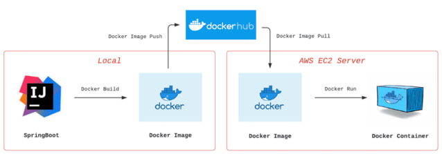

# HM study-cafe

# 프로젝트 소개
> 다니던 스터디 카페의 UX/UI의 불편함으로 시작했습니다.  
> 스터디 카페 관리 및 사용을 위한 웹개발이 주제입니다.  
> 개인 프로젝트로 진행합니다.

### FrontEnd

- 프론트는 Reactjs, Material-ui를 사용했습니다.
- [해당 템플릿](https://github.com/devraccon/React-Material-Sample) 사용 및 수정하였습니다.

### BackEnd 

- Java11, Spring-Boot3, Spring-Security, Spring-Data-JPA, QueryDSL, Spring-REST-Docs, Junit5 를 사용하였습니다.
- Spring Rest Docs를 사용하여 API 문서화를 했습니다.

### DevOps

<!--  -->
- EC2, Docker, Docker-Hub 를 사용하여 배포하였습니다.
- 구조

# ERD 구조

[👉 ERD Cloud에서 직접 보기](https://www.erdcloud.com/d/uSj93GWqSBAGewqYB)

# Spring REST Docs

- 프로덕션 코드에 영향이 없다.
- 장점이자 단점인 테스트 코드가 성공해야 문서 작성이 가능하다.

- 빌드 시 resources - static - docs 파일에 html 파일 생성

# 주요 기능

### 요약

<table align="center"><!-- 팀원 표 -->
  <tr>
   <th>
    공통
   </th>
   <th>
    사용자
   </th>
   <th >
    관리자
   </th>
   </tr>
  <tr>
   <td align="left" width="350px" class="공통">
    - 회원가입, 로그인
     
    - 게시판 등록, 조회, 수정, 삭제
   </td>
   <td align="left" width="350px" class="사용자">
    - 정기권 구매
     
    - 자리 선택
     
    - 자리 퇴장
   </td>
   <td align="left" width="350px" class="관리자">
    - 지점 등록, 삭제
     
    - 자리 등록, 삭제
     
    - 정기권 등록, 삭제
   </td>
  </tr>
</table>