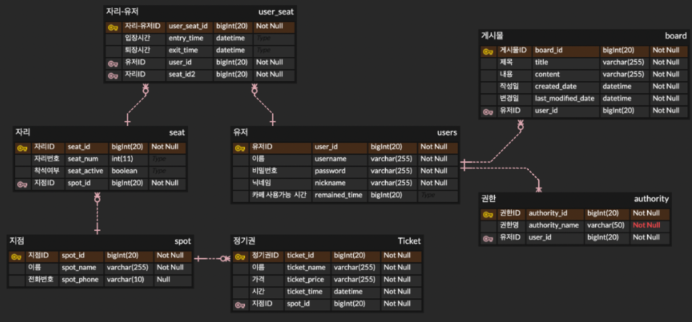
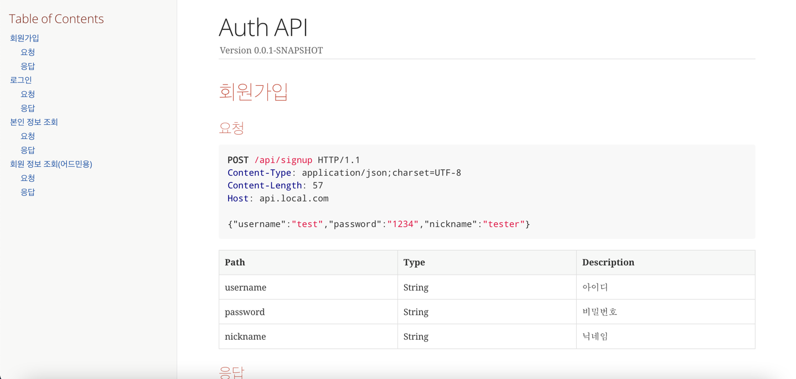

# study-cafe
- 스터디 카페 관리 및 사용을 위한 웹개발 (api)

# ERD 구조

[👉 ERD Cloud에서 직접 보기](https://www.erdcloud.com/d/uSj93GWqSBAGewqYB)

# Spring REST Docs

- 프로덕션 코드에 영향이 없다.
- 장점이자 단점인 테스트 코드가 성공해야 문서 작성이 가능하다.

- 빌드 시 resources - static - docs 파일에 html 파일 생성